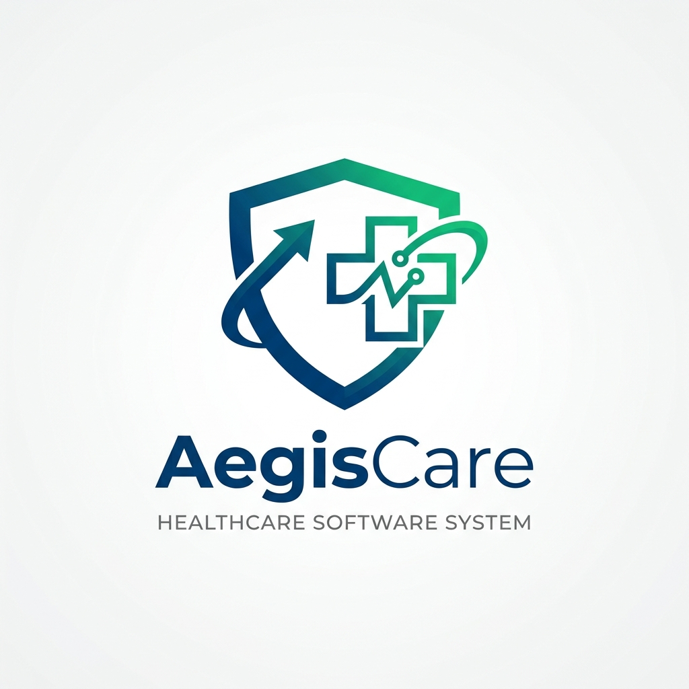

# AegisCare Medical Systems API



A professional-grade REST API for enterprise healthcare management systems with advanced role-based access control (RBAC).
Implements secure OAuth2 password-like login to issue JWTs carrying role and permission claims.

> **Note:** This project is for educational use only. To reach HIPAA compliance you must add
network, infrastructure, encryption-at-rest, BAAs, logging/monitoring, backups, and organizational safeguards.

## Quick Start

```bash
# 1) Install dependencies
npm install

# 2) Create .env
cp .env.example .env
# edit JWT_SECRET to a strong value

# 3) Seed demo data (creates users, records, permissions, and audit log file)
npm run seed

# 4) Run
npm run dev
```

Server defaults to `http://localhost:4000`.

## Roles & Permissions

- **Patient**: `view_records` (only own)
- **Nurse**: `view_records`, `update_status`
- **Doctor**: `view_records`, `update_status`, `prescribe_medication`
- **Administrator**: `manage_users`

## Endpoints (Summary)

- `POST /auth/login` — issue JWT with role & permissions
- `POST /auth/escalate` — doctor emergency escalation; returns **time-limited** elevated token (logged)
- `GET /records/:patient_id` — view records (Patient own/Nurse/Doctor)
- `PATCH /records/:patient_id/status` — update status (Nurse/Doctor)
- `POST /records/:patient_id/prescriptions` — prescribe (Doctor)
- `POST /users` — create user (Administrator)

## Security Notes

- TLS/HTTPS is **required** in production. For local dev, set `ALLOW_INSECURE_HTTP=true` **only** on localhost.
- All access is logged to `data/audit.log` with user, action, resource, and timestamp.
- Sensitive fields are never put into logs. JWTs use `role` and `permissions` claims.
- Data here is file-backed JSON for portability. Replace `utils/db.js` with a proper database in production.
